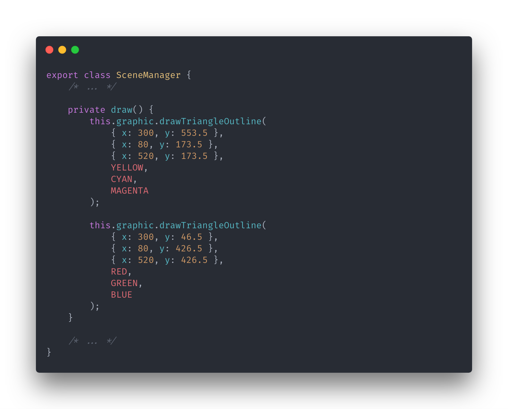
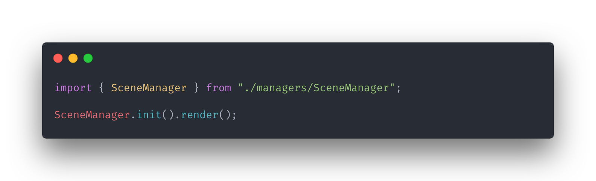

# Type WebGL

<p align="center">
    
</p>

<p align="center">
    
</p>

<p align="center">
    
</p>

## Development + Deployment

```bash
yarn watch  # watch file changes and build in development mode
```

```bash
yarn build  # build in production mode
```
